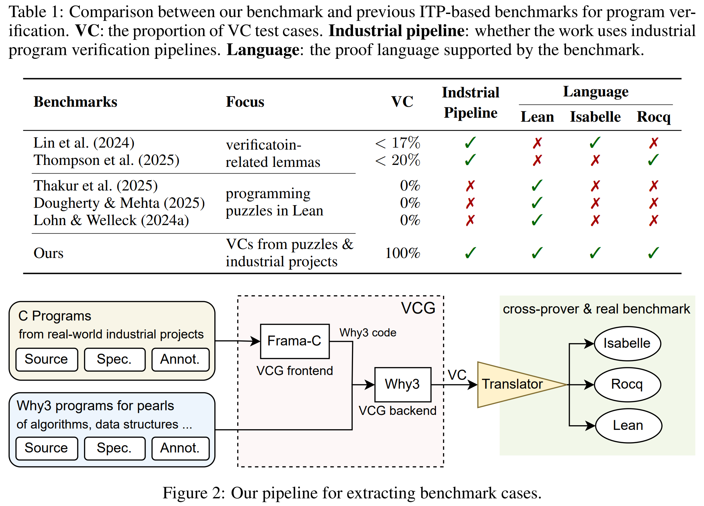

# Neural Theorem Proving for Verification Conditions
[](paper.pdf)
[](LICENSE)
[](https://openreview.net/forum?id=MfDyickxQA)
[](bib.bib)

A benhamrk based on real-world industrial pipelines and projects, across the theorem provers Isabelle, Rocq, and Lean.



## The Benchmark

The benchmark cases in the three ITP languages are respectively listed in the following manifests.
- `test_set.isabelle.lst`
- `test_set.lean.txt.lst`
- `test_set.lean.txt.lst`

Each manifest lists 600 theore-proving files (of suffix `.lean`/`.v`/`.thy`), each of which contains exactly one `theorem`/`Theorem` statement which represents one VC.

Additional to the above two folders, translations of Why3 system library are also required by these cases. They are placed under `./generation/<LANGUAGE>`.

### Structure of the Data Folder

All the VCs are translated from `.mlw` files.

> How to locate the source `.mlw` file of a given theorem-proving file?

Given a theorem-proving file `<PATH>/<NAME>_vcg/<LANGUAGE>/<FILE-NAME>`, its source `.mlw` file is `<PATH>/<NAME>.mlw`.

One `mlw` file may contain multiple modules and multiple proof goals. The goals in `mlw` file and the translated VCs in the theorem-proving files are associated as follows:
- Each `goal <NAME>` in module `<M>` is translated into file `<M>_<NAME>.<lean/thy/v>`
- Each `let <PROGRAM>` in module `<M>` is translated into file `<M>_<PROGRAM>qtvc.<lean/thy/v>`, which is the VC of the PROGRAM.

## Rules of Engagement

### Protection to Prevent Data Leakage

To prevent data leakage, if any VC from a given `mlw` file is selected for the NTP4VC benchmark; all VCs from that `mlw` file should be protected and excluded from training.
In contrast, other `mlw` files provided in our associated artifact are not protected, as long as no VC from those files is included in the NTP4VC benchmark.
Note that the `mlw` files in the Real C Verification category are generated from C projects, with each `mlw` file corresponding to a single C function.
The identity of an `mlw` file should be considered bound to its original C function. This means that `mlw` files generated through alternative means (e.g., different compilation flags) that produce varied content should also be subject to the above protection.

### Acceptable Improvements to the Translation Pipeline

The purpose of this benchmark is to advance Neural Theorem Proving capabilities on proving Verification Conditions. 
Note that NTP models built on top of specific ITP platforms are inevitably influenced by the language features and idioms of their respective platforms.
The rule-based translation provided in this work may not fully capture all such features and idioms, resulting in some VCs being translated into representations that are unnatural or unconventional for the target ITP platform.
These should be considered as deficiencies in the translation pipeline.
Therefore, to allow for addressing these potential issues, improvements to the translation pipeline that address such unnatural or unconventional representations should be considered legitimate and acceptable.
To be clear, regenerating the NTP4VC benchmark using an improved translation pipeline as described above and evaluating on the regenerated benchmark is likewise considered legitimate and acceptable.
However, any evaluation based on a regenerated NTP4VC benchmark must explicitly report any modifications made to the translation pipeline when presenting results.

## How to Use/Compile the Benchmark Cases

All the benchmark cases are configured and organized into packages using the package manager of the corresponding provers. Some setup are required to register the packages into your system.

- for Isabelle, we use the standard session management. You should run the following command to register the pakcages into the system.
```
cd NTP4Verif
isabelle components -u.
```
- for Rocq, we use `dune` to manage packages. Nothing needs to configure but you should use `dune build` to build a `.v` file, e.g.,
```
dune build ./data/why3/pearl/add_list_vcg/rocq/add_list_AddListImp_mainqtvc.vo
```
- for Lean4, we use `lake` for such management. Nothing needs to configure but you should run `lake build` to build a `.lean` file, e.g.,
```
cd data/why3
lake build ./pearl/add_list_vcg/lean/add_list_AddListImp_mainqtvc.lean
```

Because the files can have complicated dependencies, running with a pakcage manager is highly recommended.

## VC Extraction Pipeline

### Setup

#### Setup the modified Why3

```
cd why3-for-NTP
opam init
opam switch create default ocaml
eval $(opam env --switch=default)
opam install menhir zarith
./configure --prefix $(realpath ../why3)
make -j
make install
```

### Run the Extractor

#### Extracting Why3 VCs from ACSL, by Frama-C

You must use Frama-C 18.0 (a rather old version).

The commands used to extract VCs in this benchmark are different per Frama-C project. The exact extraction command is given in the `src/extraction.sh`, e.g., `data/why3/frama_c/contiki_memb/src/extraction.sh` (after you unzip `data/why3/frama_c/contiki_memb/src.tar.zst`). Nonetheless, most of the commands are based on the following one:
```
frama-c -wp -wp-rte -wp-no-warn-memory-model -wp-gen -wp-out wp_out -wp-prover why3 <the-target-C-file>
```

#### Translating Why3 VCs into Lean4/Rocq/Isabelle VCs

```
source envir.sh

# to extract pearl dataset for Lean4
./VCG.py lean data/why3/pearl --cache ./.lean.cache
# to extractpip install frama-c dataset for Lean4
./VCG.py lean data/why3/frama_c --cache ./.lean.cache -L ./lib/frama-c


# to extract pearl dataset for Rocq
./VCG.py rocq data/why3/pearl --cache ./.lean.cache
# to extract frama-c dataset for Rocq
./VCG.py rocq data/why3/frama_c --cache ./.lean.cache -L ./lib/frama-c

# to extract pearl dataset for Isabelle
ISA_REPL_ADDR=<IP-address-of-IsaREPL> ./VCG.py isabelle data/why3/pearl --cache ./.lean.cache
# to extract frama-c dataset for Isabelle
ISA_REPL_ADDR=<IP-address-of-IsaREPL> ./VCG.py isabelle data/why3/frama_c --cache ./.lean.cache -L ./lib/frama-c
```

### Run the Why3 Baseline Measurement

```
source envir.sh
./tools/why3_auto_3.py data/why3/pearl
# For frama-c cases, you must set the WHY3_LOAD=./lib/frama-c/ environment variable.
WHY3_LOAD=./lib/frama-c/ ./tools/why3_auto_3.py data/why3/frama_c/contiki_list
```

## Citation
```
@inproceedings{xu2026neural,
title={Neural Theorem Proving for Verification Conditions: A Real-World Benchmark},
author={Xu, Qiyuan and Luan, Xiaokun and Wang, Renxi and Joshua Ong Jun Leang and Wang, Peixin and Li, Haonan and Li, Wenda and Watt, Conrad},
booktitle={The Fourteenth International Conference on Learning Representations},
year={2026},
url={https://openreview.net/forum?id=MfDyickxQA}
}
```
